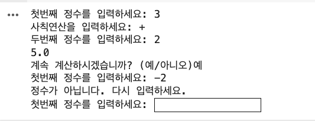
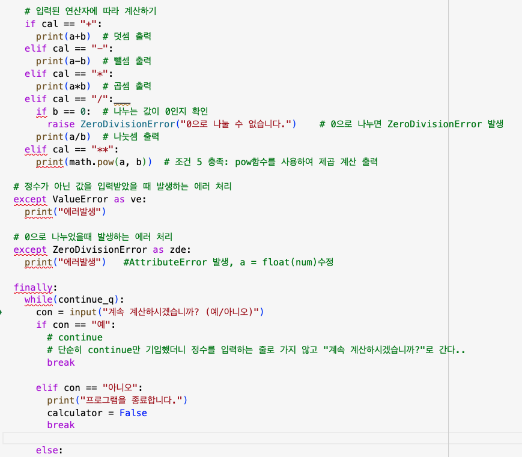
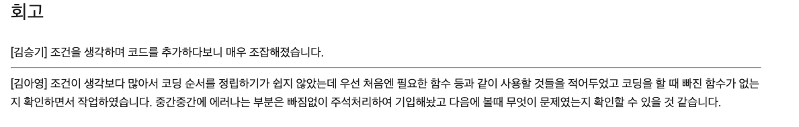
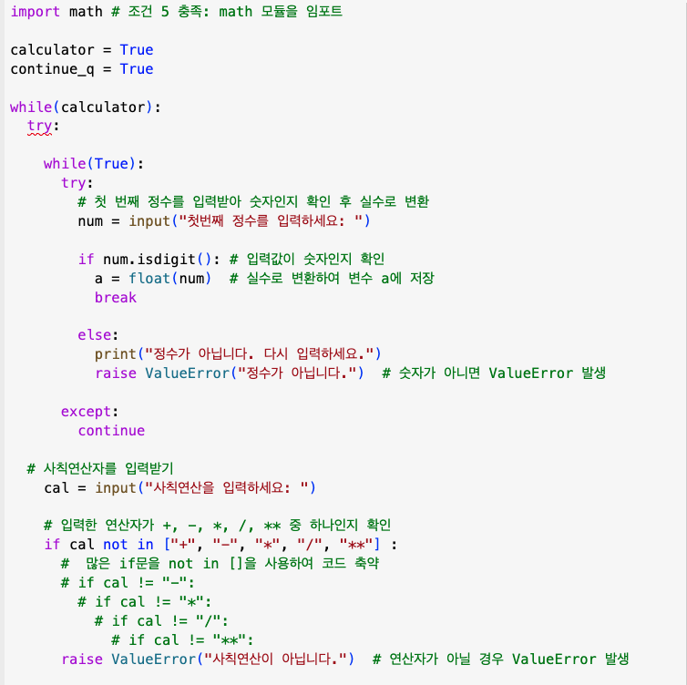

# AIFFEL Campus Online Code Peer Review Templete
- 코더 : 김아영
- 리뷰어 : 조계현


# PRT(Peer Review Template)
- [X]  **1. 주어진 문제를 해결하는 완성된 코드가 제출되었나요?**
      음수 값이 들어갔을때를 빼곤 다 정상적으로 잘 작동했습니다!


- [X]  **2. 전체 코드에서 가장 핵심적이거나 가장 복잡하고 이해하기 어려운 부분에 작성된 
주석 또는 doc string을 보고 해당 코드가 잘 이해되었나요?**
      해당 코드를 설명하는 주석들이 달려있어 이해에 도움이 되었습니다.

         
- [X]  **3. 에러가 난 부분을 디버깅하여 문제를 해결한 기록을 남겼거나
새로운 시도 또는 추가 실험을 수행해봤나요?**
      주석을 통해 작업중에 힘들었던 부분에 대해 잘 기록해두셨습니다.

        
- [X]  **4. 회고를 잘 작성했나요?**
      몰랐던 부분을 다시 확인할 수 있게 회고를 잘 작성해두셨습니다.

        
- [X]  **5. 코드가 간결하고 효율적인가요?**
      함수를 정의해두고 그 함수들을 불러오는 식으로 구성해도 좋았을것 같습니다!, 다만 작성하던 코드에 수정을 통해 간결함을 더하려 노력하신 부분이 좋았습니다.


# 회고(참고 링크 및 코드 개선)
```
음수 입력 안되셨던거 isdiit대신 int쓰시면 될꺼 같아요!!
```
