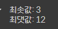
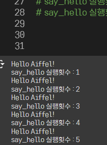
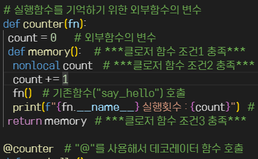
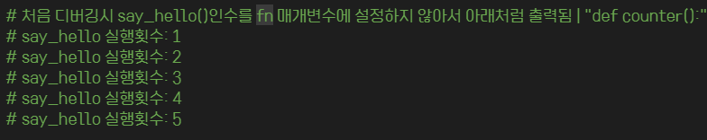

# AIFFEL Campus Online Code Peer Review Templete
- 코더 : 김아영
- 리뷰어 : 김승기


# PRT(Peer Review Template)
- [V]  **1. 주어진 문제를 해결하는 완성된 코드가 제출되었나요?**
    - 나온 결과값이 주어진 조건과 힌트에 모두 부합합니다.


    
    

    
- [V]  **2. 전체 코드에서 가장 핵심적이거나 가장 복잡하고 이해하기 어려운 부분에 작성된 
주석 또는 doc string을 보고 해당 코드가 잘 이해되었나요?**
    - 코드 한줄 한줄 모두 주석처리가 되어있으며 이해하기 쉽게 작성돼있습니다.
    - 또한 어느 줄에서 조건을 충족하는지 알아볼 수 있게 작성돼있습니다.


    


- [V]  **3. 에러가 난 부분을 디버깅하여 문제를 해결한 기록을 남겼거나
새로운 시도 또는 추가 실험을 수행해봤나요?**
    - 처음 시도했던 내용과 오류 내용이 잘 기록되어있습니다.


    


        
- [V]  **4. 회고를 잘 작성했나요?**
    - 어떤 부분에서 어려움이 있었고 어떻게 해결할 수 있었는지 확인할 수 있습니다.
    - 잘 작성된 회고입니다.
        

        
- [V]  **5. 코드가 간결하고 효율적인가요?**
    - 충분히 간결하다고 생각합니다.


# 회고(참고 링크 및 코드 개선)
```
대체적으로 잘 작성된 코드와 주석입니다.

저희 팀은 이번 퀘스트에서 난이도가 생각보다 쉬워 빠르게 해결하였으나
다른 기본적인 것들을 놓친 것 같습니다.
코드에 대한 주석(설명)이 빠졌고 
조건과 힌트에서 봤었던 함수 이름을 작성하는 부분을 빠뜨렸던 점이 아쉽습니다.
```
